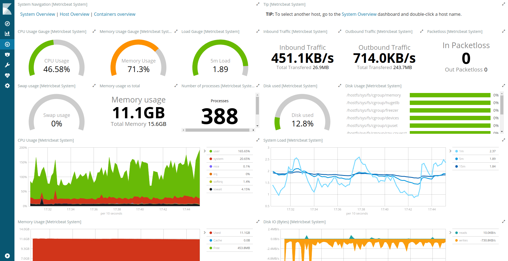
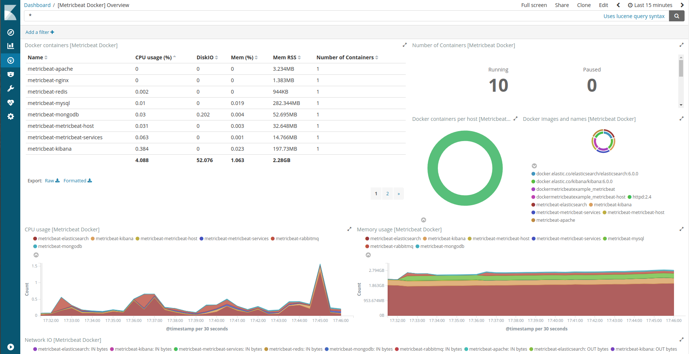

# docker-metricbeat-example

Docker and Metricbeat configurations examples.
Learn how to use Docker and Metricbeat to monitor you host system, all your nodes, your docker containers and all your (distributed) services.

**Warning**
> This project is built for example and testing.  
> DO NOT use any part of it in production unless you know exactly what you are doing.

## Install

Clone the repository

```bash
git clone git@github.com:ypereirareis/docker-metricbeat-example.git && cd docker-metricbeat-example
```

Setup your host (**sudo/root needed**).
You shoud have something like this.

```bash
$ make setup
=> ACLs on /var/run/docker.sock OK
vm.max_map_count = 262144
=> vm.max_map_count=262144 OK
2105e36d174f6ad3d0d23cac5769454d60a51fa8998fc0fbe946c4e713f1493c
Building metricbeat-host
Step 1/6 : FROM docker.elastic.co/beats/metricbeat:6.0.0
 ---> bc8ff400feac
Step 2/6 : ARG METRICBEAT_FILE=metricbeat.yml
 ---> Using cache
 ---> ebd68e798d93
Step 3/6 : COPY ${METRICBEAT_FILE} /usr/share/metricbeat/metricbeat.yml
 ---> Using cache
 ---> e24c78b4b7e8
Step 4/6 : USER root
 ---> Using cache
 ---> 84b29d7e9635
Step 5/6 : RUN mkdir /var/log/metricbeat     && chown metricbeat /usr/share/metricbeat/metricbeat.yml     && chmod go-w /usr/share/metricbeat/metricbeat.yml     && chown metricbeat /var/log/metricbeat
 ---> Using cache
 ---> 0d1485e2e4c1
Step 6/6 : USER metricbeat
 ---> Using cache
 ---> 7c5172b2912c
Successfully built 7c5172b2912c
Successfully tagged dockermetricbeatexample_metricbeat-host:latest
elasticsearch uses an image, skipping
Building metricbeat
Step 1/6 : FROM docker.elastic.co/beats/metricbeat:6.0.0
 ---> bc8ff400feac
Step 2/6 : ARG METRICBEAT_FILE=metricbeat.yml
 ---> Using cache
 ---> ebd68e798d93
Step 3/6 : COPY ${METRICBEAT_FILE} /usr/share/metricbeat/metricbeat.yml
 ---> Using cache
 ---> 19c48873ed8e
Step 4/6 : USER root
 ---> Using cache
 ---> fa6d8c6138d6
Step 5/6 : RUN mkdir /var/log/metricbeat     && chown metricbeat /usr/share/metricbeat/metricbeat.yml     && chmod go-w /usr/share/metricbeat/metricbeat.yml     && chown metricbeat /var/log/metricbeat
 ---> Using cache
 ---> b691cc7eb5bf
Step 6/6 : USER metricbeat
 ---> Using cache
 ---> 5e02571e6fb2
Successfully built 5e02571e6fb2
Successfully tagged dockermetricbeatexample_metricbeat:latest
kibana uses an image, skipping
```

## Host Monitoring

We are assuming your `docker0` interface IP is: `inet 172.17.0.1  netmask 255.255.0.0  broadcast 0.0.0.0`
If not the case, please adjust the configuration in `docker-compose.yml` file for service `metricbeat-host`.

```yaml
metricbeat-host:
  ...
  environment:
    - HOST_ELASTICSEARCH=elasticsearch:9222
    - HOST_KIBANA=kibana:5666
  extra_hosts:
    - "elasticsearch:172.17.0.1" # The IP of docker0 interface to access host from container
    - "kibana:172.17.0.1" # The IP of docker0 interface to access host from container
  network_mode: host # Mandatory to monitor host filesystem, memory, processes,...
```

Start monitoring your host.

```bash
$ make start-monitoring-host 
Creating metricbeat-elasticsearch ... 
Creating metricbeat-elasticsearch ... done
metricbeat-elasticsearch is up-to-date
Creating metricbeat-kibana ... 
Creating metricbeat-kibana ... done
Waiting for elasticsearch...
Creating metricbeat-metricbeat-host ... 
Creating metricbeat-metricbeat-host ... done
```

* You can check everything is OK, and you should have 3 containers running...
* Be careful Elasticsearch and Kibana ports are exposed on 0.0.0.0 network (every IP address).
* Default Metricbeat dashboard are automatically loaded into Kibana (`setup.dashboards.enabled: true`)

```bash
$ docker ps                 
CONTAINER ID        IMAGE                                                 COMMAND                  CREATED             STATUS              PORTS                              NAMES
e25a76b4f1e4        dockermetricbeatexample_metricbeat-host               "/usr/local/bin/do..."   2 minutes ago       Up 2 seconds                                           metricbeat-metricbeat-host
27668d971ddf        docker.elastic.co/kibana/kibana:6.0.0                 "/bin/bash /usr/lo..."   2 minutes ago       Up 2 minutes        0.0.0.0:5666->5601/tcp             metricbeat-kibana
af93d8214167        docker.elastic.co/elasticsearch/elasticsearch:6.0.0   "/usr/local/bin/do..."   2 minutes ago       Up 2 minutes        9300/tcp, 0.0.0.0:9222->9200/tcp   metricbeat-elasticsearch
```

If everything is fine, you should be able to access Kibana, and Monitoring dashboard:

* Kibana => [http://127.0.0.1:5666](http://127.0.0.1:5666/app/kibana)
* Dashboard list => [http://127.0.0.1:5666/app/kibana#/dashboards?_g=()](http://127.0.0.1:5666/app/kibana#/dashboards?_g=())
* System Overview => [http://127.0.0.1:5666/app/kibana#/dashboard/Metricbeat-system-overview?_g=()](http://127.0.0.1:5666/app/kibana#/dashboard/Metricbeat-system-overview?_g=())

**Host Dashboard**



**Docker Dashboard**



## Services Monitoring

First of all you need to start the Metricbeat container to monitor services.

```bash
make start-monitoring
```

You should now have an extra Metricbeat container for services (called `metricbeat-metricbeat-services`).

```bash
$ docker ps
CONTAINER ID        IMAGE                                                 COMMAND                  CREATED             STATUS              PORTS                              NAMES
d934ee72db19        dockermetricbeatexample_metricbeat                    "/usr/local/bin/do..."   4 minutes ago       Up 4 minutes                                           metricbeat-metricbeat-services
...
```

### Start/Stop all services

```bash
make start-all
make stop-all
```

### Start/Stop services one by one

#### Apache

* Compose file: [./docker-compose.apache.yml](./docker-compose.apache.yml)
* Start: `make start-apache`
* Stop: `make start-apache`

```bash
4f4cb6e72a39    httpd:2.4   "httpd-foreground"  11 minutes ago  Up About a minute   80/tcp  metricbeat-apache
```

#### MongoDB

* Compose file: [./docker-compose.mongodb.yml](./docker-compose.mongodb.yml)
* Start: `make start-mongodb`
* Stop: `make start-mongodb`

```bash
a379163bc90d    mongo   "docker-entrypoint..."   11 minutes ago    Up About a minute   27017/tcp    metricbeat-mongodb
```

#### MySQL

* Compose file: [./docker-compose.mysql.yml](./docker-compose.mysql.yml)
* Start: `make start-mysql`
* Stop: `make start-mysql`

```bash
3ae8e0c7c1e3    mysql:8.0   "docker-entrypoint..."   11 minutes ago   Up About a minute   3306/tcp metricbeat-mysql
```

#### Nginx

* Compose file: [./docker-compose.nginx.yml](./docker-compose.nginx.yml)
* Start: `make start-nginx`
* Stop: `make start-nginx`

```bash
da1a01c36c4c    nginx:1.13.7-alpine "nginx -g 'daemon ..."   11 minutes ago   Up About a minute   80/tcp  metricbeat-nginx
```

#### RabbitMq

* Compose file: [./docker-compose.rabbitmq.yml](./docker-compose.rabbitmq.yml)
* Start: `make start-rabbitmq`
* Stop: `make start-rabbitmq`

```bash
6c072660a008    bijukunjummen/rabbitmq-server:3.6.5 "/bin/sh -c /opt/r..."   14 minutes ago      Up 2 seconds   4369/tcp, 5672/tcp, 9100-9105/tcp, 25672/tcp, 127.0.0.1:1234->15672/tcp   metricbeat-rabbitmq
```

#### Redis

* Compose file: [./docker-compose.redis.yml](./docker-compose.redis.yml)
* Start: `make start-redis`
* Stop: `make start-redis`

```bash
52be9d662f8f    redis:3.2.11-alpine "docker-entrypoint..."   11 minutes ago Up About a minute   6379/tcp    metricbeat-redis
```

#### Others

More to come

## Clean everything

A simple command to remove all containers related to Metricbeat

```bash
$ make clean
d934ee72db19
3ae8e0c7c1e3
a379163bc90d
6c072660a008
52be9d662f8f
da1a01c36c4c
4f4cb6e72a39
a400ee0b914a
43d22a57fde4
c1ca7e0d7e6a
All METRICBEAT containers removed !
```

## (Re)start everything

```bash
$ make install
```

## LICENSE

MIT License

Copyright (c) 2017 Yannick Pereira-Reis

Permission is hereby granted, free of charge, to any person obtaining a copy
of this software and associated documentation files (the "Software"), to deal
in the Software without restriction, including without limitation the rights
to use, copy, modify, merge, publish, distribute, sublicense, and/or sell
copies of the Software, and to permit persons to whom the Software is
furnished to do so, subject to the following conditions:

The above copyright notice and this permission notice shall be included in all
copies or substantial portions of the Software.

THE SOFTWARE IS PROVIDED "AS IS", WITHOUT WARRANTY OF ANY KIND, EXPRESS OR
IMPLIED, INCLUDING BUT NOT LIMITED TO THE WARRANTIES OF MERCHANTABILITY,
FITNESS FOR A PARTICULAR PURPOSE AND NONINFRINGEMENT. IN NO EVENT SHALL THE
AUTHORS OR COPYRIGHT HOLDERS BE LIABLE FOR ANY CLAIM, DAMAGES OR OTHER
LIABILITY, WHETHER IN AN ACTION OF CONTRACT, TORT OR OTHERWISE, ARISING FROM,
OUT OF OR IN CONNECTION WITH THE SOFTWARE OR THE USE OR OTHER DEALINGS IN THE
SOFTWARE.
